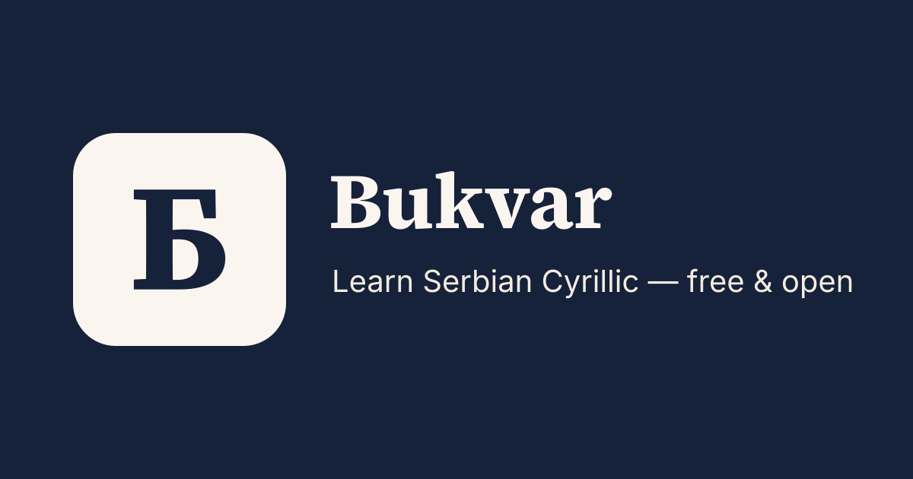

<p align="center">
  
</p>

> _Bukvar_ (буквар) is the Serbian word for a first-grade ABC primer.

An open-source, local-first web app for learning the **Serbian Cyrillic
alphabet** and **high-frequency vocabulary** with spaced repetition - five
minutes a day, free and fully offline.

**[bukvar.app](https://bukvar.app)**

## What it does

- **Spaced repetition** (FSRS, via [`ts-fsrs`](https://github.com/open-spaced-repetition/ts-fsrs))
  schedules reviews by recall probability, so you study what's due and skip what
  isn't.
- **Cyrillic literacy** - learn to read the azbuka from day one, with mnemonics
  for the "false friend" letters (В, Н, Р, С, У, Х ...).
- **Both scripts** - flip between Ћирилица and Latinica anytime.
- **Local-first** - everything lives in your browser (IndexedDB). No account, no
  server, installable as a PWA, works offline.

## Develop

```sh
yarn install
yarn dev        # http://localhost:4321
yarn test       # scheduler unit tests
yarn typecheck  # astro check + svelte-check
yarn build      # static build into dist/
```

## Status

Working today, local-first and offline:

- daily spaced-repetition review loop with **new-cards/day pacing**
- first-run script onboarding, persisted preference
- streak + daily-goal habit tracking
- Cyrillic-literacy track: full azbuka reference + recognition drill
- a browsable, indexable dictionary - cross-linked per-word and per-letter pages
- progress export/import (JSON backup & restore)

The corpus is the 30-letter azbuka + **~975 words across 29 themed topics**
(`src/data/words/`), each hand-authored via the `word()` helper (Latin/IPA/id
derived).

Roadmap: audio, and growing the corpus toward thousands of words.

## Contributing

The most valuable contributions are corpus additions and fixes: words,
mnemonics, and example sentences. Entries are hand-authored (never pasted, for
licensing reasons) via the `word()` helper. See
[`CONTRIBUTING.md`](./CONTRIBUTING.md) to get started.

## License

[GPL-3.0](./LICENSE).
